# GitHub Actions CI/CD 配置指南

## 功能

这个 workflow 会在你每次 push 到 `main` 分支时自动部署到 AWS EC2。

## 配置步骤

### 1. 在 GitHub 设置 Secrets

进入你的 GitHub 仓库：
1. 点击 **Settings** → **Secrets and variables** → **Actions**
2. 点击 **New repository secret**
3. 添加以下 3 个 secrets：

#### Secret 1: EC2_HOST
```
Name: EC2_HOST
Value: 你的EC2公网IP (例如: 54.123.45.67)
```

#### Secret 2: EC2_USERNAME
```
Name: EC2_USERNAME
Value: ubuntu
```

#### Secret 3: EC2_SSH_KEY
```
Name: EC2_SSH_KEY
Value: 你的私钥内容 (uoft-assistant-key.pem 文件的完整内容)
```

**获取私钥内容：**

Windows PowerShell:
```powershell
Get-Content uoft-assistant-key.pem | clip
```

Mac/Linux:
```bash
cat uoft-assistant-key.pem | pbcopy  # Mac
cat uoft-assistant-key.pem | xclip   # Linux
```

然后粘贴到 GitHub Secret 的 Value 中。

### 2. 确保 EC2 上的代码目录正确

SSH 到 EC2，确认：
```bash
# 检查项目目录
ls -la /home/ubuntu/uoft-assistant

# 检查 git remote
cd /home/ubuntu/uoft-assistant
git remote -v

# 应该显示你的 GitHub 仓库地址
```

### 3. 测试自动部署

完成配置后，任何 push 到 main 分支的操作都会触发自动部署：

```bash
# 本地修改代码后
git add .
git commit -m "Test CI/CD"
git push origin main

# 🎉 自动部署开始！
```

查看部署状态：
- 进入 GitHub 仓库
- 点击 **Actions** 标签
- 查看最新的 workflow 运行状态

### 4. 部署失败排查

如果部署失败，检查：

1. **GitHub Secrets 是否正确设置**
   - EC2_HOST 是否是正确的公网 IP
   - EC2_SSH_KEY 是否包含完整的私钥内容（包括 BEGIN 和 END 行）

2. **EC2 上的目录权限**
   ```bash
   ls -la /home/ubuntu/uoft-assistant
   # 确保 ubuntu 用户有权限
   ```

3. **systemd 服务是否配置**
   ```bash
   sudo systemctl status uoft-assistant
   ```

4. **查看 GitHub Actions 日志**
   - 在 Actions 页面点击失败的 workflow
   - 查看详细错误信息

## 工作流程

```mermaid
graph LR
    A[本地 git push] --> B[GitHub Actions 触发]
    B --> C[SSH 连接到 EC2]
    C --> D[git pull 最新代码]
    D --> E[更新 Python 依赖]
    E --> F[重启 systemd 服务]
    F --> G[健康检查]
    G --> H[部署完成 ✅]
```



## 高级配置

### 只在特定文件改变时部署

修改 `deploy.yml` 中的 `on` 部分：

```yaml
on:
  push:
    branches:
      - main
    paths:
      - 'app/**'
      - 'static/**'
      - 'requirements.txt'
      - '.env'
```

### 添加 Slack/Discord 通知

使用第三方 Actions 发送部署通知：

```yaml
- name: Slack Notification
  uses: 8398a7/action-slack@v3
  with:
    status: ${{ job.status }}
    webhook_url: ${{ secrets.SLACK_WEBHOOK }}
```

## 安全注意事项

1. ⚠️ **永远不要提交私钥到 git**
2. ⚠️ **定期轮换 EC2 SSH 密钥**
3. ⚠️ **限制 GitHub Actions 只能访问必要的资源**
4. ✅ **使用 GitHub Secrets 存储敏感信息**
5. ✅ **定期审查 Actions 日志**

---

配置完成后，享受自动部署的便利吧！🚀
